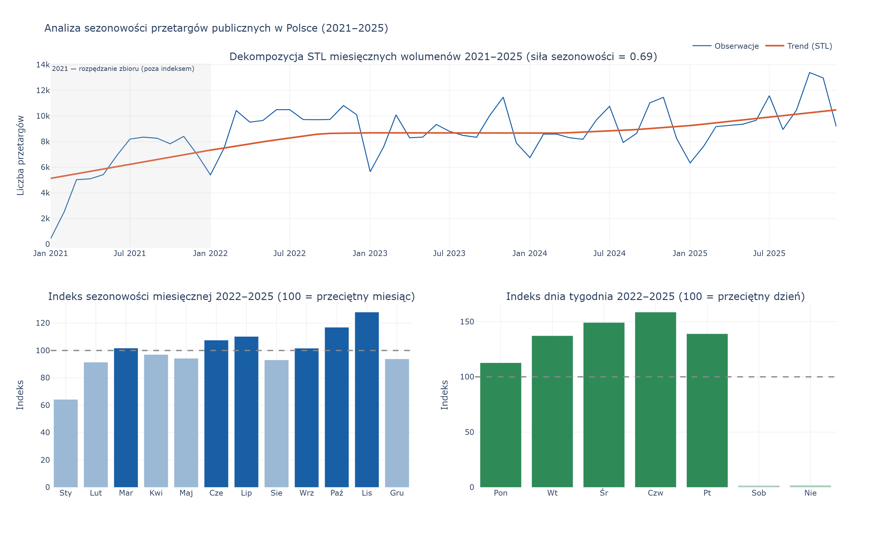
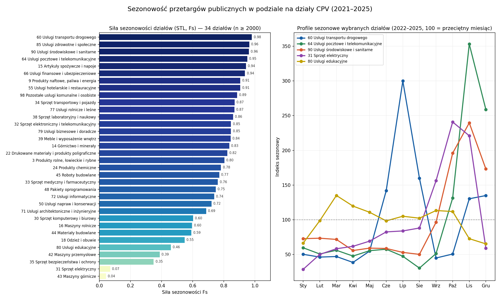

# Spis treści
- [Dane wejściowe](#dane-wejściowe)
- [Omówienie i analiza uzyskanych danych](#omówienie-i-analiza-uzyskanych-danych)
- [Analiza rozkładu przetargów](#analiza-rozkładu-przetargów)
  - [Wstęp](#wstęp)
  - [Analiza rozkładu kodów CPV](#analiza-rozkładu-kodów-cpv)
  - [Analiza rozkładu działów przetargów](#analiza-rozkładu-działów-przetargów)
  - [Róznice pomiędzy województwami](#róznice-pomiędzy-województwami)
    - [Najpopularniejsze kody w województwach](#najpopularniejsze-kody-w-województwach)
    - [Odchylenie pomiędzy województwami](#odchylenie-pomiędzy-województwami)
    - [2021](#2021)
    - [2022](#2022)
    - [2023](#2023)
    - [2024](#2024)
    - [2025](#2025)
    - [Legenda](#legenda)
    - [Podsumowanie](#podsumowanie)
- [Analiza sezonowości rozkładu przetargów](#analiza-sezonowości-rozkładu-przetargów)
  - [Współczynniki trendu i sezonowości](#współczynniki-trendu-i-sezonowości)
    - [Sezonowość](#sezonowość)
    - [Trend](#trend)
  - [Zmiana liczby przetargów w analizowanym zakresie czasu](#zmiana-liczby-przetargów-w-analizowanym-zakresie-czasu)
  - [Analiza sezonowości dziedzin CPV](#analiza-sezonowości-dziedzin-cpv)
- [Analiza rozkładu przetargów względem innych czynników](#analiza-rozkładu-przetargów-względem-innych-czynników)
  - [Wstęp](#wstęp-1)
  - [Analiza danych](#analiza-danych)
    - [Liczba przetargów względem PKB województw](#liczba-przetargów-względem-pkb-województw)
    - [Liczba przetargów względem populacji województw](#liczba-przetargów-względem-populacji-województw)
    - [Liczba przetargów względem populacji województw z wykluczeniem Warszawy z województwa Mazowieckiego](#liczba-przetargów-względem-populacji-województw-z-wykluczeniem-warszawy-z-województwa-mazowieckiego)
    - [Populacja względem PKB](#populacja-względem-pkb)
    - [Liczba przetargów względem PKB per capita](#liczba-przetargów-względem-pkb-per-capita)
- [Podsumowanie](#podsumowanie-1)
- [Wnioski](#wnioski)

# Dane wejściowe
Analizie poddano dane pobrane z portalu [eZamówienia BZP](https://ezamowienia.gov.pl/mo-client-board/bzp) 
za pomocą API ([eZam-Database-extraction](https://github.com/98CharleS/eZam-Database-extraction)), 
które zostały następnie sformatowane i opracowane 
([eZam-Database-formating](https://github.com/98CharleS/eZam-Database-formating)) 
w celu uzyskania standaryzacji, czytelności i możliwości obsługi w innych programach.
Import danych skonfigurowano od **01.01.2020**, jednak najwcześniejsze dostępne ogłoszenie pochodzi z **2 stycznia 2021 r.** Portal eZamówienia w obecnym kształcie funkcjonuje bowiem dopiero od **1 stycznia 2021 r.**, wraz z wejściem w życie znowelizowanego **Prawa zamówień publicznych**, i nie zawiera wcześniejszych postępowań. Faktyczny zakres czasowy zbioru obejmuje zatem przetargi z okresu **02.01.2021–31.12.2025**, a sam zbiór liczy **517 840** elementów.
# Omówienie i analiza uzyskanych danych 
Z pośród dostępnych artrbutów `TenderType` oraz `procedureResult` wszędzie zawierały wartość NULL. Są to atrybuty, które w bazie danych pozostają nieużywane. Dodatkowo wszystkie przetargi w analizowanym zakresie posiadały taką samą wartość `True` w kolumnie `isTenderAmountBelowEU`. Wartość tego atrybutu określa czy wartość przetargu była poniżej wartości **[progu Unijnego](https://www.gov.pl/web/uzp/aktualne-progi-unijne-oraz-ich-rownowartosci-w-zlotych-na-lata-2026-2027)**. Same wartości `True` oznaczają, że wszystkie przetargi z analizowanego zbioru były poniżej **progu Unijnego**.  W celu poprawy czytelnośći i integralności danych, wyżej wspomniane kolumny zostały odrzucone.

# Analiza rozkładu przetargów
## Wstęp
W pobranych danych w kolumnie `cpvCode` znajdowało się wiele kodów CPV. Wynika to z charakterystyki struktury ogłoszeń o przetargach, gdzie wstępuje jeden główny kod CPV, następnie może występować wiele dodatkowych kodów CPV, których kluczowość dla całości przedmiotu przetargu może być zróżnicowana. 
Ze względu na to, że niemożliwa jest ocena istotności dodatkowego kodu CPV dla całości przetargu, a różna liczba dodatkowych kodów zaburzyłaby statystykę częstotliwości w odniesieniu do liczby przetargów, analizie poddano wyłącznie główny kod CPV dostępny w atrybutach każdego wpisu. Przyjęte podejście zapewnia standaryzację, spójność i czytelność wyników.

## Analiza rozkładu kodów CPV

W analizowanej bazie danych wystepuje **5047** kodów CPV. Widoczna jest bardzo duża dysproporcja pomiędzy liczbą przetargów podlegająych pod poszczególne kody CPV. **51,79%** wszystkich kodów CPV wystąpiło **mniej niż 10 razy** w bazie danych, **mniej niż 100 razy** wystąpiło aż **87,18%** kodów CPV, a **mniej niż 1 000 razy** wystąpiło aż **98,18%** zbioru. 
Wszystkie kody CPV, które stanowią w zbiorze 1% lub więcej przedstawia poniższa tabela:

| Kod CPV | Nazwa | Liczba przetargów | Udział % |
|---------|-------|-------------------|----------|
| **45000000-7** | Roboty budowlane | 58 906 | **11,38%** |
| 45200000-8 | Roboty drogowe | 9 423 | 1,82% |
| 45231000-6 | Roboty w zakresie budowy dróg | 9 148 | 1,77% |
| 71200000-3 | Usługi inżynierskie w zakresie projektowania | 8 356 | 1,61% |
| 79700000-3 | Usługi ochroniarskie | 6 220 | 1,20% |
| 45300000-9 | Roboty remontowe i renowacyjne | 5 944 | 1,15% |
| 45243000-0 | Roboty w zakresie nawierzchni dróg | 5 160 | 1,00% 

Najpopularniejszy kod CPV - "**45000000-7 Roboty budowlane**" wystąpił jako główny kod CPV w **58 906** przetargach co stanowiło **11,38%** wszystkich przetargów ze zbioru. Następny najpopularniejszy kod **45200000-8 Roboty drogowe** wystąpił w **9 423** przetargach co było liczbą ponad **6-krotnie mniejszą**. Różnice pomiędzy ilościami przetargów z danymi kodami CPV maleją wraz ze spadkiem liczby przetargów.
Taki rozkład danych świadczy o tym, że zbiór charakteryzuje się rozkładem silnie prawoskośnym z długim ogonem.

## Analiza rozkładu działów przetargów

**Kody CPV** są dokładnym przedstawieniem tematyki przetargu, lecz ze względu szczegółówość jest ich bardzo wiele i dzielą wszystkie przetargi na wąskie zakresy, które są ciężkie do przedstawienia wizualnego i generalizacji. Dla uproszczenia **kody CPV zaagregowano w 45 działów** obejmujące szerszy zakres. Działy przyjęto zgodnie z obowiązującym podziałem wynikającym z [Rozporządzenie Komisji (WE) nr 213/2008 z dnia 28 listopada 2007 r ](https://eur-lex.europa.eu/legal-content/PL/TXT/?uri=CELEX:32008R0213).

10 najliczniejszych działów przedstawia poniższa tabela:

| Kod | Nazwa | Liczba przetargów | Udział % |
|-----|-------|-------------------|----------|
| **45** | Roboty budowlane | 167 010 | **32,25%** |
| 33 | Sprzęt medyczny i farmaceutyczny | 39 843 | 7,69% |
| 71 | Usługi architektoniczne i inżynieryjne | 31 379 | 6,06% |
| 90 | Usługi środowiskowe i sanitarne | 23 543 | 4,55% |
| 15 | Artykuły spożywcze i napoje | 22 319 | 4,31% |
| 9 | Produkty naftowe, paliwa i energia | 20 268 | 3,91% |
| 34 | Sprzęt transportowy i pojazdy | 19 757 | 3,82% |
| 30 | Sprzęt komputerowy i biurowy | 19 462 | 3,76% |
| 79 | Usługi biznesowe i doradcze | 15 855 | 3,06% |
| 39 | Meble i wyposażenie wnętrz | 14 948 | 2,89% |

Najwięcej przetargów dotyczyło działu **Roboty budowlane**, który skupiał **32,25%** wszystkich przetargów i stanowił wyraźnego lidera zestawienia. Potwierdza to obserwacje z poprzedniej analizy, w której **kody CPV** związane z robotami budowlanymi również dominowały pod względem liczebności. Pomiędzy pierwszym a drugim miejscem wystąpiła istotna dysproporcja – kolejny dział, **Sprzęt medyczny i farmaceutyczny**, skupiał **7,69%** przetargów, co oznacza, że był **4,19-krotnie mniej liczny niż lider**. Różnica ta, choć znacząca, jest wyraźnie mniejsza niż analogiczna dysproporcja zaobserwowana na poziomie pojedynczych **kodów CPV**, gdzie lider przewyższał następnika ponad 6-krotnie.
Dalsze pozycje rankingu zajmowały działy: **Usługi architektoniczne i inżynieryjne (6,06%), Usługi środowiskowe i sanitarne (4,55%)** oraz **Artykuły spożywcze i napoje (4,31%)**. Różnice pomiędzy kolejnymi działami w tej części zestawienia są już znacznie mniejsze i stopniowo maleją wraz ze spadkiem liczby przetargów. Działy zajmujące pozycje od 6. do 10. – **Produkty naftowe, paliwa i energia, Sprzęt transportowy i pojazdy, Sprzęt komputerowy i biurowy, Usługi biznesowe i doradcze oraz Meble i wyposażenie wnętrz –** skupiały odpowiednio od **3,91% do 2,89%** przetargów, tworząc relatywnie zwartą grupę o zbliżonych udziałach.
Zjawisko mniejszego rozwarstwienia wynika z naturalnego efektu agregacji – grupowanie kodów CPV w działy niweluje ekstremalne różnice widoczne przy bardziej szczegółowym poziomie klasyfikacji. Rozkład tych danych również wykazuje charakter silnie prawoskośny z długim ogonem, co oznacza, że zdecydowana większość przetargów koncentruje się w nielicznych działach, podczas gdy pozostałe kategorie – w tym **Usługi związane z przemysłem naftowym** z zaledwie 18 przetargami – stanowią marginalny udział w zbiorze.

W dalszej analize stosowany będzie podział zarówno na **działy jak i kody CPV** w zależności od indywidualnej szczegółowści analizowanego zagadeniania.

## Róznice pomiędzy województwami

### Najpopularniejsze kody w województwach

We wszystkich województwach najliczniejszym **kodem CPV** były **Roboty budowlane**, które stanowiły od 51,5% do aż 69,9% wszystkich przetargów z grupy 5 najliczniejszych i skupiły łącznie 58 906 przetargów.
Następnym pod względem liczebności jest **kod CPV Budowa dróg**, który w pozycjach od 2 do 5 wystąpił w 11 z 16 województw skupiając łącznie 7427 przetargów. Zaraz za tym kodem wystąpił kod **Roboty drogowe**, który wystąpił również w 11 województwach na pozycjach od 2 do 5 i skupił 7403 przetargów. Również podobny, choć nieco mniejszy wynik obserwujemy w przypadku **kodu CPV Usługi projektowania**. Skupił 7034 przetargi i wystąpił tak samo w 11 województwach na pozycjach od 2 do 5.

### Odchylenie pomiędzy województwami
W celu ilościowego porównania struktury przedmiotowej zamówień między województwami dla każdego z nich obliczono udział poszczególnych **45 działów** w ogólnej liczbie jego przetargów, a następnie zestawiono go ze strukturą **krajową**. Jako miarę rozbieżności przyjęto **odległość całkowitego wahania** (Total Variation Distance, TVD = ½·Σ|udział_woj − udział_kraj|), która przyjmuje wartości od 0% do 100% i wyraża, jaki odsetek przetargów danego województwa musiałby zostać przypisany do innych działów, aby jego struktura była identyczna ze strukturą krajową. Im wyższa wartość, tym bardziej profil zamówień województwa odbiega od przeciętnego.

| Województwo | Odchylenie (TVD) | Liczba przetargów |
|-------------|:----------------:|------------------:|
| **Lubuskie** | **9,2%** | 12 681 |
| **Kujawsko-pomorskie** | **9,1%** | 26 891 |
| Wielkopolskie | 8,0% | 41 803 |
| Mazowieckie | 7,9% | 91 898 |
| Pomorskie | 7,8% | 29 471 |
| Podkarpackie | 7,4% | 29 010 |
| Podlaskie | 7,2% | 18 300 |
| Opolskie | 6,5% | 13 748 |
| Warmińsko-mazurskie | 6,4% | 19 835 |
| Świętokrzyskie | 6,4% | 18 060 |
| Zachodniopomorskie | 6,1% | 22 245 |
| Łódzkie | 6,0% | 30 341 |
| Małopolskie | 5,9% | 47 809 |
| Lubelskie | 5,4% | 32 420 |
| Dolnośląskie | 5,0% | 36 298 |
| **Śląskie** | **4,0%** | 47 023 |

Odchylenia są **niewielkie** — mieszczą się w przedziale od **4,0% do 9,2%** (średnio **6,8%**, mediana **6,5%**), co oznacza, że struktura przedmiotowa zamówień jest w skali kraju wysoce **jednorodna**. Wynika to bezpośrednio z opisanej wcześniej dominacji działu **45 (Roboty budowlane)**, którego udział we wszystkich województwach pozostaje zbliżony — od **29,1%** (Pomorskie) do **37,5%** (Lubuskie) przy średniej krajowej **32,3%**. Żadne województwo nie ma zatem zasadniczo odmiennego profilu, a różnice dotyczą wyłącznie proporcji działów dalszych pozycji.

Największe odchylenie odnotowały **Lubuskie** (9,2%) oraz **Kujawsko-pomorskie** (9,1%). W przypadku **Lubuskiego** wynika ono z ponadprzeciętnego udziału robót budowlanych (37,5% wobec 32,3% w kraju, +5,3 pp) oraz sprzętu transportowego, przy jednoczesnym niedoreprezentowaniu artykułów spożywczych (2,5% wobec 4,3%) i sprzętu medycznego. **Kujawsko-pomorskie** wyróżnia się natomiast nietypowo wysokim udziałem usług finansowych i ubezpieczeniowych (dz. 66: 4,1% wobec 1,4%, +2,7 pp), sprzętu medycznego i farmaceutycznego (dz. 33: 10,3% wobec 7,7%) oraz usług zdrowotnych — co wskazuje na silniejszą niż przeciętnie obecność zamawiających z sektora ochrony zdrowia i instytucji finansowych.

Osobnego komentarza wymaga **Mazowieckie** (7,9%), którego odchylenie ma charakter wyraźnie **metropolitalny**: ponadprzeciętny udział usług biznesowych i doradczych (dz. 79: 5,2% wobec 3,1%, +2,2 pp), usług informatycznych (dz. 72) oraz pakietów oprogramowania (dz. 48), przy najniższym w tej grupie udziale robót budowlanych (30,1%). Profil ten odzwierciedla koncentrację instytucji centralnych i sektora usług w aglomeracji warszawskiej.

Na przeciwległym biegunie znajduje się **Śląskie** (4,0%) — województwo o strukturze najbliższej średniej krajowej, z jedynie nieznacznie podwyższonym udziałem artykułów spożywczych (6,2% wobec 4,3%). Również **Dolnośląskie** (5,0%) i **Lubelskie** (5,4%) reprezentują profil typowy. Warto zauważyć, że odchylenie nie jest powiązane z wielkością województwa — duże **Mazowieckie** (91 898 przetargów) odbiega od średniej silniej niż znacznie mniejsze **Świętokrzyskie** (18 060), o czym decyduje nie skala, lecz lokalna specyfika gospodarcza i instytucjonalna zamawiających.

### 2021

Rok 2021 stanowił pierwszą pełną edycję systemu przetargowego funkcjonującego w reżimie znowelizowanego Prawa zamówień publicznych, obowiązującego od 1 stycznia 2021 r. W strukturze zamówień dominował kod CPV **45000000-7** (**roboty budowlane**), przy czym wolumeny przetargów były zróżnicowane przestrzennie — od 1168 postępowań w województwie **mazowieckim** do 248 w **podlaskim**. Na dalszych pozycjach rankingów regionalnych utrwaliły się kategorie infrastruktury drogowej (CPV **45233120-6**, **45233140-2**), usług inżynieryjnych (**71320000-7**) oraz ochrony osób i mienia (**79710000-4**). Wyraźna specyfika regionalna objawiała się m.in. dominacją usług szkoleniowych w województwie **lubelskim** (CPV **80500000-9**, 103 postępowania) — co koresponduje z intensywnym współfinansowaniem projektów z Europejskiego Funduszu Społecznego w tamtym okresie — oraz obecnością usług odśnieżania w **Małopolsce** (**90620000-9**, 134 postępowania), odzwierciedlającą warunki geograficzne regionu.

### 2022

Rok 2022 przyniósł we wszystkich analizowanych województwach wyraźne zwiększenie wolumenu postępowań przetargowych. W **Mazowieckiem** liczba przetargów budowlanych wzrosła z 1168 do 1971, w **Dolnośląskiem** — z 684 do 1053, a w **Śląskiem** — z 972 do 1454. Wzrost ten można interpretować jako skumulowany efekt: odblokowania inwestycji wstrzymanych w dobie pandemii COVID-19, absorbcji środków z Krajowego Planu Odbudowy oraz przesuniętego w czasie uruchomienia perspektywy finansowej UE 2021–2027. Charakterystycznym novum roku 2022 było masowe pojawienie się kodu CPV **30213100-6** (**komputery przenośne**) w wielu województwach jednocześnie — **Dolnośląskiem** (118), **Kujawsko-Pomorskiem** (101), **Lubuskiem** (54), **Warmińsko-Mazurskiem** (77), **Zachodniopomorskiem** (80) i **Wielkopolskiem** (161). Zjawisko to niemal z pewnością wiązało się z centralnie koordynowanym programem wyposażenia szkół w sprzęt komputerowy. Odnotowano również wzrost aktywności w zakresie zamówień na urządzenia komputerowe (**30200000-1**) — m.in. w **Podkarpackiem** (126) i **Podlaskiem** (66).

### 2023

W roku 2023 nastąpiła częściowa korekta wolumenu po szczytowym roku poprzednim. W województwie **mazowieckim** liczba przetargów budowlanych nieznacznie spadła z 1971 do 1861, a w **śląskim** — z 1454 do 1148. Równocześnie jednak w województwie **lubelskim** zaobserwowano dynamiczny wzrost kategorii drogowych (CPV **45233120-6**: wzrost z 149 do 214; CPV **45233000-9**: wzrost ze 143 do 187), co może świadczyć o przesunięciu priorytetów inwestycyjnych w kierunku infrastruktury transportowej na wschodniej flance kraju. Pojawiające się w strukturze zamówień kody CPV **33100000-1** (**urządzenia medyczne**) w **Dolnośląskiem** (111) i **Kujawsko-Pomorskiem** (69) wskazują na kontynuację doposażania placówek ochrony zdrowia, zapoczątkowanego jeszcze w reakcji na pandemię. Kategoria usług ochroniarskich (**79710000-4**) umocniła swoją pozycję w rankingach większości województw.

### 2024

W roku 2024 wolumeny przetargów utrzymały się na poziomach porównywalnych z rokiem poprzednim, przy czym wyraźne ożywienie zanotowało **Mazowieckie** (powrót do 1979 postępowań budowlanych) i **Łódzkie** (wzrost z 809 do 951). Istotnym sygnałem jakościowej zmiany struktury popytu był dynamiczny wzrost zamówień na usługi ubezpieczeniowe (CPV **66510000-8**) w województwie **kujawsko-pomorskim** — z 146 do 212 — co może odzwierciedlać rosnącą świadomość zarządzania ryzykiem w sektorze publicznym. W **Małopolskiem** po raz pierwszy w czołówce rankingu znalazły się produkty farmaceutyczne (CPV **33600000-6**, 187 postępowań), co wpisuje się w systematyczne zwiększanie aktywności przetargowej szpitali regionalnych. Warta odnotowania jest również wyraźna obecność robót remontowych (CPV **45453000-7**) w strukturach zamówień **Mazowieckiego** (292) i **Wielkopolskiego** (159) — co może sugerować, że dotychczasowy nacisk na nowe inwestycje zaczyna być uzupełniany przez systematyczne utrzymanie istniejącej infrastruktury.

### 2025

Dane za rok 2025 ujawniają dwie wyraziste tendencje jakościowe. Po pierwsze, kod CPV **31122000-7** (**jednostki prądotwórcze**) pojawił się nagle i z wysokimi wolumenami w województwach: **lubelskim** (109), **podlaskim** (79), **warmińsko-mazurskim** (70) oraz **łódzkim** (129). Koncentracja geograficzna tego popytu — silna na wschodzie i północnym wschodzie kraju — wskazuje na związek z kontekstem geopolitycznym (bezpośrednie sąsiedztwo z Ukrainą i Białorusią) oraz z realizacją programów wzmacniania odporności infrastrukturalnej. Po drugie, pozycja CPV **80000000-4** (**usługi edukacyjne i szkoleniowe**) zanotowała znaczący wzrost w województwach: **lubuskim** (138), **śląskim** (183), **łódzkim** (146) i **lubelskim** (110). Może to świadczyć o intensywnej absorpcji środków z Europejskiego Funduszu Społecznego Plus w ramach bieżącej perspektywy finansowej. Warty uwagi jest również wzrost liczby przetargów na samochody osobowe (CPV **34110000-1**) w kilku województwach (**kujawsko-pomorskie**, **lubuskie**, **zachodniopomorskie**), co może odzwierciedlać odroczone decyzje o odnowieniu flot pojazdów publicznych po latach cięć inwestycyjnych.

### Legenda

### Podsumowanie

W całym analizowanym okresie kod CPV **45000000-7** zajmował bezwzględnie pierwszą pozycję we wszystkich województwach i we wszystkich latach, przy czym udział tej pozycji CPV w rankingach był na tyle przeważający, że uzasadnia traktowanie jej nie jako jednej z kategorii zamówień, lecz jako konstytutywnej cechy polskiego rynku zamówień publicznych. Wartości bezwzględne były przy tym silnie skorelowane z wielkością demograficzno-ekonomiczną regionów: **Mazowieckie** i **Śląskie** konsekwentnie odnotowywały wolumeny kilkukrotnie wyższe niż województwa o mniejszym potencjale gospodarczym (**Lubuskie**, **Opolskie**, **Świętokrzyskie**).

Systematyczny wzrost wolumenu przetargów na usługi projektowania inżynieryjnego (CPV **71320000-7**) w latach 2021–2025 może być interpretowany jako wskaźnik wyprzedzający przyszłych inwestycji budowlanych — faza projektowania poprzedza realizację o jeden do kilku lat. Obserwacja ta sugeruje, że rynek zamówień publicznych w Polsce nie wykazuje jeszcze oznak nasycenia w segmencie infrastrukturalnym.

Trwałe różnice w składzie pozycji CPV między województwami odzwierciedlają nie tylko warunki geograficzne (odśnieżanie w **Małopolsce** i **Podkarpaciu**, infrastruktura drogowa we wschodniej Polsce), lecz również strukturę instytucjonalną zamawiających — koncentrację szpitali klinicznych (produkty farmaceutyczne i wyroby medyczne w **Małopolsce** i **Śląskiem**), obecność dużych instytucji edukacyjnych (usługi szkoleniowe w **Lubelskim** i **Łódzkim**) czy aktywność samorządów metropolitalnych (ochrona i remonty w **Mazowieckiem**).

Analiza danych wskazuje, że polska struktura zamówień publicznych jest wrażliwa na zewnętrzne impulsy systemowe: zakupy sprzętu ICT dla szkół w 2022 r., wzrost zapotrzebowania na agregaty prądotwórcze w kontekście geopolitycznym w 2025 r. czy intensyfikacja usług szkoleniowych w związku z absorpcją EFS+. Zjawisko to świadczy o wysokiej reaktywności rynku zamówień na decyzje podejmowane na poziomie centralnym lub unijnym, co może być postrzegane zarówno jako cecha adaptacyjna systemu, jak i sygnał ograniczonej autonomii strategicznej zamawiających regionalnych.

# Analiza sezonowości rozkładu przetargów

Dekompozycję sezonowości oraz indeksy miesięczne i tygodniowe przedstawia poniższy wykres wygenerowany skryptem [`seasonality.py`](seasonality.py). Trend i dekompozycję STL policzono na pełnym zakresie 2021–2025, natomiast indeksy sezonowe na latach 2022–2025 — rok 2021 stanowił okres rozpędzania zbioru (styczeń 2021 ≈ 15 przetargów/dzień wobec 175–218 w kolejnych latach), co zaniżałoby profil sezonowy.

## Współczynniki trendu i sezonowości
Charakterystykę szeregu czasowego opisano za pomocą dekompozycji STL miesięcznych wolumenów przetargów oraz miar siły trendu i sezonowości (Wang, Smith, Hyndman), przyjmujących wartości z przedziału od 0 do 1.

### Sezonowość
Współczynnik siły sezonowości `Fs=0.691` wskazuje na silną, regularną sezonowość — ponad **69%** zmienności szeregu po usunięciu trendu jest wyjaśniane przez powtarzalny wzorzec roczny. Potwierdza to amplituda indeksu sezonowego: miesiąc szczytowy (**listopad**, indeks **128,1**) generuje blisko dwukrotnie więcej przetargów (`1,99×`) niż miesiąc o najniższej aktywności (**styczeń**, indeks **64,2**), przy współczynniku zmienności indeksu miesięcznego `CV=15,1%`.
Oprócz cyklu rocznego dane wykazują również silną **sezonowość tygodniową** — publikacje koncentrują się w dni robocze (szczyt w **czwartek**, indeks **158,6**), a w weekendy aktywność jest znikoma (indeks `≈1,7`).

### Trend
Współczynnik siły trendu `Ft=0.637` (liczony na pełnym zakresie 2021–2025) wskazuje na wyraźny, choć słabszy od sezonowości komponent trendu. Jest on jednak w przeważającej części efektem jednorazowego **rozpędzania zbioru w 2021 roku**, a nie trwałego wzrostu liczby przetargów. Po ograniczeniu analizy do stabilnego okresu **2022–2025** dopasowanie trendu liniowego jest bardzo słabe — współczynnik Pearsona `r=0.241` oraz determinacji `R²=0.058` oznaczają, że model liniowy wyjaśnia zaledwie ok. **6%** zmienności miesięcznych wolumenów. Nachylenie linii trendu wynosi `+28` przetargów na miesiąc (`+337` rocznie), co wobec średniego poziomu ok. **9 000** przetargów miesięcznie jest wartością marginalną. Oznacza to, że po zakończeniu okresu wdrożenia platformy w 2021 roku liczba przetargów ustabilizowała się, a obserwowane wahania mają charakter niemal wyłącznie sezonowy.

## Zmiana liczby przetargów w analizowanym zakresie czasu
Liczba publikowanych przetargów wyraźnie wzrosła w pierwszych dwóch latach funkcjonowania zbioru, po czym ustabilizowała się na zbliżonym poziomie.
W **2021 roku** opublikowano **73 597** przetargów, jednak był to okres rozpędzania platformy — styczeń 2021 to średnio zaledwie **26,5** przetargu dziennie wobec ok. 175–218 w kolejnych latach.
W **2022 roku** liczba przetargów wzrosła do **113 592**, co oznacza skok o **+54,3%** względem roku poprzedniego i odzwierciedla pełne wdrożenie obowiązkowej elektronizacji zamówień.
W kolejnych latach wolumen utrzymywał się w wąskim przedziale: **104 408** w 2023 r. (**−8,1%**), **108 229** w 2024 r. (**+3,7%**) oraz **118 007** w 2025 r. (**+9,0%**), który był rokiem o najwyższej liczbie przetargów w całym zbiorze.

Dopasowanie trendu liniowego do miesięcznych wolumenów z pełnego zakresu **2021–2025** daje współczynnik Pearsona `r=0.544` oraz determinacji `R²=0.296`, przy nachyleniu `+69` przetargów na miesiąc (`+829` rocznie).
Wynik ten jest jednak w przeważającej części efektem jednorazowego rozpędzania zbioru w 2021 roku, a nie trwałego wzrostu liczby przetargów.
Po ograniczeniu analizy do stabilnego okresu **2022–2025** dopasowanie trendu liniowego niemal zanika — współczynnik Pearsona `r=0.241` oraz determinacji `R²=0.058` oznaczają, że model liniowy wyjaśnia zaledwie ok. **6%** zmienności miesięcznych wolumenów.
Nachylenie linii trendu wynosi w tym okresie `+28` przetargów na miesiąc (`+337` rocznie), co wobec średniego poziomu ok. **9 255** przetargów miesięcznie jest wartością marginalną.
Oznacza to, że po zakończeniu okresu wdrożenia platformy w 2021 roku ogólna liczba przetargów ustabilizowała się, a obserwowane wahania mają charakter niemal wyłącznie sezonowy (zob. [Analiza sezonowości rozkładu przetargów](#analiza-sezonowości-rozkładu-przetargów)).

## Analiza sezonowości dziedzin CPV
Aby ocenić sezonowość w przekroju przedmiotowym, dla każdego z **45 działów** zbudowano osobny miesięczny szereg czasowy (dane [`tenders_by_month_and_division`](data/tenders_by_month_and_division.csv)) i policzono dla niego te same miary co dla całego zbioru: **siłę sezonowości STL** (`Fs`, zakres 2021–2025) oraz **indeks sezonowy** wraz z amplitudą szczyt/dołek (lata 2022–2025). Analizę ograniczono do **34 działów o wolumenie ≥ 2000** przetargów, ponieważ dla działów rzadkich współczynniki są zbyt zaszumione, by je interpretować. Wyniki generuje skrypt [`seasonality_by_division.py`](seasonality_by_division.py).

Działy **wyraźnie różnią się** stopniem regularności — siła sezonowości waha się od `Fs=0.98` do niemal zera. Najsilniej sezonowe są **powtarzalne usługi kontraktowane cyklicznie**, najsłabiej — **jednorazowe dostawy sprzętu i maszyn**.

**Działy o najsilniejszej sezonowości:**

| Dział | Fs | Amplituda (szczyt/dołek) | Szczyt → dołek |
|-------|:--:|:--:|:--:|
| **60 Usługi transportu drogowego** | **0,98** | 7,8× | lip → kwi |
| 90 Usługi środowiskowe i sanitarne | 0,96 | 4,8× | lis → sie |
| 85 Usługi zdrowotne i społeczne | 0,96 | 4,7× | gru → sie |
| 64 Usługi pocztowe i telekomunikacyjne | 0,95 | **11,6×** | lis → sie |
| 15 Artykuły spożywcze i napoje | 0,94 | 5,3× | lis → kwi |
| 66 Usługi finansowe i ubezpieczeniowe | 0,94 | 3,6× | lis → sty |
| 9 Produkty naftowe, paliwa i energia | 0,91 | 4,7× | lis → kwi |

Dominującym wzorcem jest **szczyt jesienny (listopad)** z dołkiem w okresie wakacyjnym lub na początku roku. Odpowiada to mechanizmowi **kontraktowania usług ciągłych z wyprzedzeniem na kolejny rok kalendarzowy** — ubezpieczenia (dz. 66), dostawy paliw i energii (dz. 9), usługi pocztowe (dz. 64), sanitarne (dz. 90) czy żywieniowe (dz. 15) są rozstrzygane jesienią, aby obowiązywać od stycznia. Pokrywa się to z listopadowym szczytem zaobserwowanym dla całego zbioru. Wyjątkiem jest **transport drogowy** (dz. 60), którego szczyt przypada na **lipiec** — co odpowiada kontraktowaniu dowozu uczniów przed rozpoczęciem roku szkolnego we wrześniu.

**Działy o najsłabszej sezonowości:**

| Dział | Fs | Amplituda (szczyt/dołek) | Szczyt → dołek |
|-------|:--:|:--:|:--:|
| 43 Maszyny górnicze | 0,04 | 6,8× | paź → sty |
| 31 Sprzęt elektryczny | 0,07 | 8,4× | paź → sty |
| 35 Sprzęt bezpieczeństwa i ochrony | 0,35 | 6,4× | paź → sty |
| 42 Maszyny przemysłowe | 0,39 | 4,1× | paź → sty |
| 80 Usługi edukacyjne | 0,46 | 2,1× | mar → gru |
| 18 Odzież i obuwie | 0,55 | 1,9× | paź → sty |

Najniższe wartości `Fs` osiągają **dostawy sprzętu i maszyn** (sprzęt elektryczny `Fs=0.07`, maszyny górnicze `Fs=0.04`, maszyny przemysłowe `Fs=0.39`), czyli zamówienia o charakterze **jednorazowym i projektowym**, których termin wynika z indywidualnych potrzeb inwestycyjnych, a nie z kalendarza budżetowego. Warto zauważyć, że działy te wykazują przy tym **wysoką amplitudę** (sprzęt elektryczny 8,4×), lecz **niską siłę sezonowości** — oznacza to, że ich wahania mają charakter **nieregularnych skoków**, a nie powtarzalnego wzorca rocznego. Pokazuje to, dlaczego sama amplituda jest myląca, a miara `Fs` (oddzielająca regularną sezonowość od szumu) lepiej oddaje rzeczywistą cykliczność.

Odrębny rytm wykazują **usługi edukacyjne** (dz. 80, `Fs=0.46`) — ich szczyt przypada na **marzec**, a dołek na **grudzień**, co odzwierciedla cykl **akademicki**, a nie budżetowy. Z kolei dominujący w całym zbiorze dział **45 (Roboty budowlane)** plasuje się pośrodku skali (`Fs=0.77`) ze szczytem w **lipcu** i dołkiem w **grudniu**, zgodnie z naturalnym sezonem prac budowlanych.

# Analiza rozkładu przetargów względem innych czynników
## Wstęp
Nie ma dostępnych danych udziału **miasta Warszawy** w ogólnym PKB kraju. Jedyne dostępne dane przedstawiają udział **Regionu Warszawskiego Stołecznego** według podziału **NUTS 2**. Przekształcenie danych uzyskanych z platformy eZamówienia na system **NUTS 2** mogłoby doprowadzić do złej alokacji jednostek samorządu terytorialnego ze względu na oryginalną strukturę danych zawierających `organizationProvince`, które przedstawia województwo zamawiającego, oraz `organizationCity`, które przedstawia miejscowość zamawiającego. Ze względu na skalę wynikającą z ilości miejscowości wchodzących w skład **Regionu Warszawskiego Stołecznego**, a jednocześnie małą precyzyjność oryginalnych danych przedstawiających lokalizację przetargu w odniesieniu do układu administracyjnego, konwersja danych do formatu **NUTS 2** i wzbogacenie ich o dane odnośnie populacji w gminach wchodzących w skład **Regionu Warszawskiego Stołecznego** obarczone jest zbyt dużym ryzykiem złej agregacji danych podczas procesu konwersji.
W związku z powyższym jedynie podczas analizy korelacji liczby ludności do liczby przetargów możliwe było wyłączenie miasta Warszawy jako osobnej jednostki.

## Analiza danych
### Liczba przetargów względem PKB województw
Liczba przetargów w województwie jest wysoce skorelowana ze wskaźnikiem PKB danego województwa.
Współczynnik Pearsona `r=0.974` oznacza bardzo silną dodatnią korelację.
Współczynnik determinacji `R²=0.949` wskazuje, że model liniowy bardzo dobrze opisuje zróżnicowanie liczby przetargów w oparciu o PKB.
Na wykresie widać, że województwo **Mazowieckie** wyraźnie odstaje od pozostałych elementów zbioru zarówno na osi reprezentującej liczbę przetargów, jak i PKB, lecz jest niemal idealnie na linii trendu.

### Liczba przetargów względem populacji województw
Liczba przetargów w województwach jest również wysoce skorelowana z liczbą mieszkańców danego województwa, lecz nie tak mocno jak w przypadku PKB.
Współczynnik Pearsona `r=0.953` oznacza bardzo silną dodatnią korelację.
Współczynnik determinacji `R²=0.908` wskazuje, że model liniowy dobrze opisuje zróżnicowanie liczby przetargów w oparciu o populację.
Na wykresie widać, że również w tym przypadku **województwo Mazowieckie** wyraźnie odstaje od pozostałych elementów zbioru zarówno na osi reprezentującej liczbę przetargów, jak i liczbę ludności, lecz tym razem jest znacznie oddalone od linii trendu w kierunku większej liczby przetargów na osobę niż pozostałe elementy zbioru.

### Liczba przetargów względem populacji województw z wykluczeniem Warszawy z województwa Mazowieckiego
Po odseparowaniu **miasta Warszawy** od reszty **województwa Mazowieckiego** ogólna korelacja spadła.
Współczynnik Pearsona `r=0.874` oznacza silną dodatnią korelację, choć wyraźnie słabszą niż przy pełnych danych **województwa Mazowieckiego**.
Współczynnik determinacji `R²=0.764` wskazuje, że model liniowy wyjaśnia około 76% zmienności liczby przetargów w oparciu o populację — jest to spadek o ponad 14 punktów procentowych względem analizy bez podziału **województwa Mazowieckiego**.
Pomimo tego, że korelacja spadła względem wykresu **Liczba przetargów względem populacji województw**, na wykresie widać, że **województwo Mazowieckie** po wykluczeniu **miasta Warszawy** zbliżyło się do linii trendu, a pozostałe województwa skupiają się wokół niej. Wyjątkiem pozostaje **miasto Warszawa**, które na tle zbioru wyróżnia się wysoką liczbą przetargów na osobę.

### Populacja względem PKB
W celu sprawdzenia zależności pomiędzy dwoma analizowanymi czynnikami stworzono wykres przedstawiający PKB województw w zestawieniu z populacją.
Współczynnik Pearsona `r=0.951` oznacza bardzo silną dodatnią korelację między PKB a liczbą ludności województw.
Współczynnik determinacji `R²=0.904` wskazuje, że ponad 90% zmienności PKB można wyjaśnić samą liczbą mieszkańców, co potwierdza, że obie zmienne są silnie współzależne i nie stanowią niezależnych predyktorów liczby przetargów.
Liczba ludności rośnie w tym samym kierunku co PKB województwa. Warto zauważyć na tym wykresie również odmienną pozycję **województwa Mazowieckiego**, którego PKB jest wyraźnie wyższe względem liczby ludności niż w przypadku innych województw.

### Liczba przetargów względem PKB per capita
Współczynnik Pearsona `r=0.880` oznacza silną dodatnią korelację, jednak niższą niż w przypadku PKB absolutnego.
Współczynnik determinacji `R²=0.775` wskazuje, że model liniowy wyjaśnia około 78% zmienności liczby przetargów — wynik gorszy niż dla PKB całkowitego, co sugeruje, że sama zamożność per capita jest słabszym predyktorem aktywności przetargowej niż skala gospodarcza regionu.
Pomimo relatywnie wysokich wartości **współczynnika Pearsona i determinacji**, na wykresie widać znacznie większe rozproszenie elementów zbioru niż w poprzednich wykresach.

# Podsumowanie
1. Opis danych
Analizie poddano **517 840** przetargów pochodzących z portalu eZamówienia (BZP) i obejmujących okres **2021–2025**. W ramach przygotowania danych odrzucono atrybuty pozbawione wartości informacyjnej (`TenderType` i `procedureResult` — wyłącznie wartości NULL — oraz `isTenderAmountBelowEU` o stałej wartości `True`), a analizę kodów CPV oparto wyłącznie na głównym kodzie każdego ogłoszenia. Dla celów generalizacji kody CPV zagregowano w **45 działów** zgodnych z Rozporządzeniem Komisji (WE) nr 213/2008.

2. Opis popularności
Rozkład przetargów — zarówno na poziomie pojedynczych **kodów CPV** (5047 kodów), jak i **działów** — jest silnie **prawoskośny z długim ogonem**. Niekwestionowanym liderem jest kod **45000000-7 (Roboty budowlane)**, skupiający **11,38%** wszystkich przetargów na poziomie CPV oraz **32,25%** na poziomie działów, ponad sześciokrotnie przewyższając kolejną pozycję rankingu. Dominacja robót budowlanych jest powszechna — kod ten zajmował pierwsze miejsce we **wszystkich województwach i we wszystkich latach** — natomiast dalsze pozycje rankingów regionalnych odzwierciedlają specyfikę geograficzną i instytucjonalną poszczególnych województw.

3. Opis zmian w czasie
Ogólna liczba przetargów wzrosła skokowo w okresie wdrażania platformy (z **73 597** w 2021 r. do **113 592** w 2022 r.), po czym ustabilizowała się w przedziale **104–118 tys.** rocznie. Po wyłączeniu rozpędzania zbioru z 2021 roku trend liniowy praktycznie zanika (`R²=0.058`), co oznacza, że wolumen przetargów osiągnął nasycenie. Zmienność szeregu ma charakter niemal wyłącznie **sezonowy** — siła sezonowości `Fs=0.691`, ze szczytem w **listopadzie** i dołkiem w **styczniu** (różnica blisko dwukrotna) oraz wyraźną koncentracją publikacji w dni robocze. Na poziomie struktury przedmiotowej widoczna jest natomiast wysoka reaktywność rynku na zewnętrzne impulsy systemowe (zakupy sprzętu ICT dla szkół w 2022 r., agregaty prądotwórcze w 2025 r. czy usługi szkoleniowe finansowane z EFS+).

4. Czynniki zewnętrzne
PKB jest najlepszym czynnikiem, na podstawie którego można przewidzieć liczbę przetargów. Wysoka korelacja liczby przetargów z PKB oznacza, że regiony o silniejszej gospodarce regionalnej generują więcej przetargów. Jest to logiczna zależność, lecz pokazuje, że aktywność przetargowa w Polsce pozostaje silnie skoncentrowana w najbardziej rozwiniętych gospodarczo regionach. Może to świadczyć o utrzymujących się dysproporcjach regionalnych pomimo licznych programów, takich jak **Program Operacyjny Polska Wschodnia 2014–2020 (PO PW)**, **Fundusze Europejskie dla Polski Wschodniej 2021–2027 (FEPW)** oraz **Regionalne Programy Operacyjne (RPO)** finansowane z funduszy UE, które miały na celu wyrównywanie dysproporcji rozwojowych między województwami.
Tezę o utrzymującej się koncentracji aktywności przetargowej potwierdzają wykresy liczby przetargów do liczby ludności, na których widać liniowy wzrost liczby przetargów wraz z liczbą ludności. Wyjątkiem pozostaje **miasto Warszawa**, które generuje znacznie więcej przetargów na osobę, niż wynikałoby to z trendu. Widać to dokładnie w zawyżonym wyniku **województwa Mazowieckiego** na wykresie drugim oraz na wykresie trzecim z wydzielonym **miastem Warszawa**, którego wartość dopasowania modelu (`R²=0.764`) jest o ponad 18 punktów procentowych niższa niż wykresu z całym **województwem Mazowieckim** (`R²=0.949`).
Anomalię związaną z zawyżonym wynikiem **województwa Mazowieckiego** widać również na wykresie czwartym, a dobitnie na wykresie piątym, gdzie pozostałe województwa reprezentują podobny poziom liczby przetargów i PKB per capita, skupiając się w lewym dolnym rogu, podczas gdy **województwo Mazowieckie** znajduje się odizolowane w przeciwnym. Słabsze dopasowanie modelu na wykresie piątym pokazuje, że sama zamożność per capita nie jest dobrym predyktorem liczby przetargów — liczy się przede wszystkim bezwzględna skala gospodarcza regionu.
W celu lepszego zbadania zasadności korelacji liczby przetargów z PKB należałoby wyłączyć **miasto Warszawę** lub **Warszawski Region Stołeczny** z **województwa Mazowieckiego**, co z przyczyn wyjaśnionych we wstępie nie zostało wykonane.

# Wnioski
1. **Zastosowanie badań i pracy**

   Wyniki analizy mają bezpośrednie zastosowanie praktyczne dla obu stron rynku zamówień. Dla **wykonawców** najważniejszym wnioskiem operacyjnym jest możliwość **planowania kalendarza ofertowego i mocy przerobowych** w oparciu o rozpoznane wzorce sezonowe — wiedza, że usługi kontraktowane cyklicznie rozstrzygane są w **listopadzie**, a dowóz uczniów (dz. 60) w **lipcu**, pozwala z wyprzedzeniem przygotować zespoły i zasoby pod spodziewane szczyty. Drugim kierunkiem jest **rozwój w stronę segmentów rosnących rok do roku**: systematyczny wzrost zamówień na usługi projektowania inżynieryjnego (CPV **71320000-7**) zapowiada przyszłe inwestycje budowlane, a kategorie reagujące na impulsy systemowe (agregaty prądotwórcze, sprzęt ICT dla szkół, usługi szkoleniowe finansowane z EFS+) wskazują obszary o rosnącym popycie, w których warto budować kompetencje. Dla **zamawiających** praktyczną wskazówką jest natomiast **publikowanie postępowań poza listopadowym szczytem** — w okresie mniejszej kumulacji ogłoszeń konkurencja o uwagę wykonawców jest mniej rozproszona, co zwiększa szansę na większą liczbę ofert i korzystniejsze warunki.

2. **Prognozowalność rynku zamówień**

   Prognozowalność rynku zamówień jest dwojaka. **Komponent regularny** — ogólna liczba przetargów — jest dobrze przewidywalny: po zakończeniu wdrożenia platformy wolumen ustabilizował się (`R²=0.058` dla trendu w stabilnym okresie 2022–2025), a jego wahania mają charakter niemal wyłącznie **sezonowy** (`Fs=0.691`) z powtarzalnym rytmem rocznym i tygodniowym. Pozwala to prognozować miesięczne i tygodniowe poziomy aktywności prostym modelem sezonowym. **Komponentu strukturalnego** — tego, *które* kategorie nagle zyskają na znaczeniu — nie da się natomiast przewidzieć z samego szeregu czasowego, ponieważ zależy on od decyzji zewnętrznych: programów centralnych, kontekstu geopolitycznego czy harmonogramu transz unijnych. Wykazana wysoka reaktywność rynku oznacza jednak, że takie zmiany **da się wcześnie wykryć i wyjaśnić**, traktując nietypowe skoki w strukturze przedmiotowej jako sygnał o uruchomieniu konkretnego impulsu systemowego. Rynek jest więc przewidywalny w swoim rytmie, lecz nie w treści szoków popytowych.

3. **Ograniczenia analizy i kierunki dalszych badań**

   Przedstawione wnioski należy odczytywać w świetle **ograniczeń analizy**. Po pierwsze, zbiór obejmuje wyłącznie postępowania **poniżej progu unijnego** (`isTenderAmountBelowEU=True`), poza analizą pozostają zatem największe zamówienia. Po drugie, badano **liczbę** przetargów, a nie ich **wartość** — wyniki opisują aktywność przetargową, lecz nie skalę wydatków. Po trzecie, analiza opierała się **wyłącznie na głównym kodzie CPV** każdego ogłoszenia, a atrybut `procedureResult` zawierał wartości NULL, co uniemożliwiło ocenę rozstrzygnięć i konkurencyjności postępowań. Nierozwiązany pozostał również problem wydzielenia **miasta Warszawy / Warszawskiego Regionu Stołecznego** z województwa mazowieckiego w układzie NUTS 2. Naturalnym kierunkiem dalszych badań jest zatem powiązanie zbioru z **wartościami umów**, **liczbą składanych ofert** (jako miarą intensywności konkurencji) oraz **danymi o zwycięzcach**, co pozwoliłoby przejść od analizy samej aktywności do analizy efektywności i konkurencyjności rynku zamówień publicznych.
